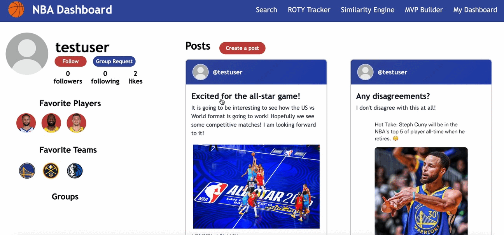
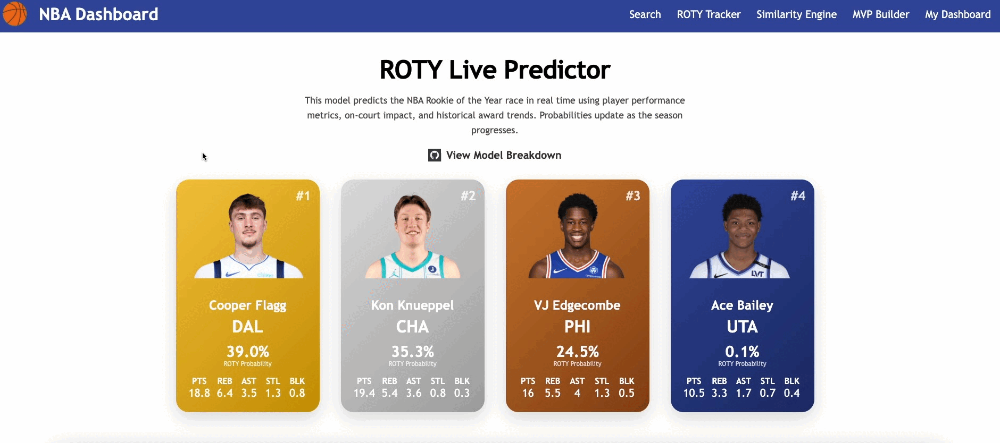

# nba-dashboard

## Overview

**NBA Dashboard** is a full-stack web application that blends sports analytics, social networking, and machine learning. Built from the ground up, it enables NBA fans to engage with data in a meaningful, interactive way.

Users can create accounts, connect with friends, form groups, and favorite their favorite NBA players and teams. What sets this platform apart is its powerful integration of machine learning tools that provide smart insights and predictions based on basketball data.

This project highlights my end-to-end capabilities in designing and engineering both frontend and backend systems, along with integrating  AI services.

---

## Key Features

### 👥 User Experience / Social Networking
- Full account creation and login/logout system

- Personalized user dashboard and post creation

- Player and team profile pages

#### More features...
- Friend system: add/remove friends
- Group system: create and join interest groups
- Favorite players and teams for quick access

---

### Machine Learning / AI Features

#### ROTY Prediction Model
- Developed a Python Random Forest model to predict NBA Rookie of the Year probabilities, tracking current rookies' live chances with 72% accuracy using historical performance data.

#### Player Similarity Engine
- Users can explore players who are statistically similar to a selected player based on performance metrics using cosine similarity.

